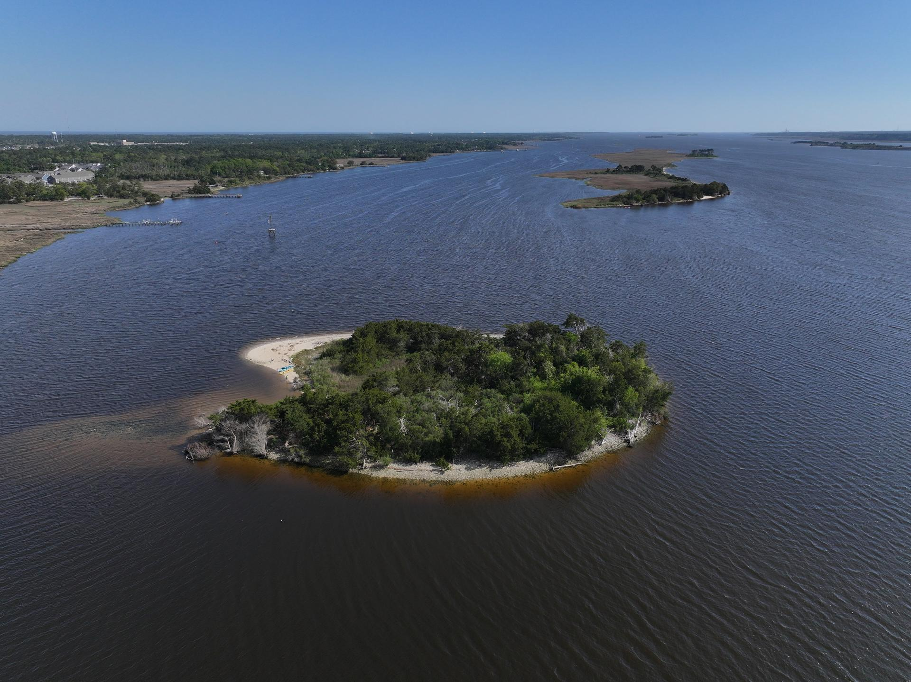

# SharkToothIsland.org

**Coastal Field Station — Cape Fear River — New Hanover County, NC**

A free, public web resource for Shark Tooth Island, a dredge spoil island in the Cape Fear River where Miocene and Pliocene-era fossilized shark teeth wash up regularly. The site serves fossil hunters, kayakers, and paleontology enthusiasts.

**Live site:** https://sharktoothisland.org
**Repository:** github.com/mozyoutdoors-oss/sharktoothisland

---

## Quick Start

This is a static site. No build step, no framework, no dependencies to install.

```bash
# Local development
npx http-server . -p 8080 -c-1

# Deploy (GitHub Pages auto-deploys on push)
git add <files>
git commit -m "your message"
git push origin main
# Wait ~60 seconds, then verify at https://sharktoothisland.org
```

---

## Tech Stack

| Layer | Technology |
|-------|-----------|
| Hosting | GitHub Pages (static, auto-deploy from `main`) |
| Domain | sharktoothisland.org via Porkbun (ALIAS + CNAME → mozyoutdoors-oss.github.io) |
| CSS | Tailwind CSS 3 via CDN (`forms` + `container-queries` plugins) |
| Fonts | Public Sans (headline/body), Space Grotesk (labels), Material Symbols Outlined |
| JavaScript | Vanilla JS — no frameworks, no build step |
| APIs | NOAA CO-OPS Tides, Open-Meteo Weather |
| Email Capture | Web3Forms |
| HTTPS | GitHub Pages auto-cert, enforced |

---

## Pages

### `index.html` — Field Guide (Homepage)
The main landing page. Species identification guide with 6 illustrated shark tooth cards (Megalodon, Great White, Tiger, Mako, Bull, Snaggletooth). Includes How to Visit section, PRPA legal callout, live tidal visualization iframe, photo breaks, tools callout, and newsletter signup.

### `megalodon-calculator-v5.html` — Size Calculator
Interactive tool: enter a tooth's slant height (25–175mm) and get estimated body length, mass, jaw width, and bite force. Uses the Pimiento & Clements 2014 field formula (`body_ft ≈ tooth_inches × 8.5`). Features animated SVG shark silhouette with comparative scale, 5-tier rarity classification, and science notes.

### `hunt-planner.html` — Hunt Planner
Real-time conditions tool. Pulls NOAA tide predictions (Station 8658715, Federal Point) and Open-Meteo weather data (33.9465, -77.9421). Scores each day on a 100-point scale across tidal range, low tide timing, precipitation, and wind. Generates SVG tide curves and Go/Maybe/Pass verdicts with moon phase effects.

### `depth-of-time.html` — Depth of Time (Coming Soon)
Geological timeline placeholder showing stratigraphic column from Holocene through Eocene.

### `island-hero.html` — Live Visualization
Dark-themed 3D tidal visualization. Embedded via iframe in the Field Guide. Intentionally dark (#080F1A) — not restyled to light theme. Uses `scrolling="no"` and `overflow:hidden`.

---

## Design System (Stitch)

All pages share the same Tailwind config with Material Design 3-inspired tokens.

### Colors
```
primary:              #085F9E    (CTA buttons, active states, accent borders)
on-surface:           #1A1C1C    (headlines, primary text)
on-surface-variant:   #414750    (body text, descriptions)
surface:              #F9F9F9    (page background)
outline:              #717781    (subtle labels)
outline-variant:      #C1C7D2    (borders, dividers)
primary-fixed:        #D1E4FF    (text selection background)
```

### Typography
- **Public Sans** — headlines and body (weights 300–800)
- **Space Grotesk** — labels, data readouts, uppercase tracking
- **Material Symbols Outlined** — icons (variable weight/fill)

### Radius
Minimal: `0.125rem` default, `0.75rem` max. The site is archival/editorial, not rounded.

---

## Key Constants

| Constant | Value | Used In |
|----------|-------|---------|
| NOAA Station | `8658715` (Federal Point, Cape Fear River) | hunt-planner.html |
| Latitude | `33.9465` | hunt-planner.html (Open-Meteo) |
| Longitude | `-77.9421` | hunt-planner.html (Open-Meteo) |
| Display Coords | `34.113° N · 77.930° W` | All footers |
| Web3Forms Key | `8ca6fa3e-a04a-4261-8937-e214a48f785f` | index.html newsletter |
| Body Length Formula | `tooth_inches × 8.5` | megalodon-calculator-v5.html |
| Tooth Range | 25–175 mm | megalodon-calculator-v5.html |
| Moon Cycle | 29.53059 days (ref: 2000-01-06) | hunt-planner.html |
| Contact | Station@sharktoothisland.org | All footers |

---

## DNS (Porkbun)

```
ALIAS  sharktoothisland.org      → mozyoutdoors-oss.github.io  (600)
CNAME  *.sharktoothisland.org    → mozyoutdoors-oss.github.io  (600)
CNAME  www.sharktoothisland.org  → mozyoutdoors-oss.github.io  (600)
MX     sharktoothisland.org      → fwd1.porkbun.com (prio 10)  (600)
MX     sharktoothisland.org      → fwd2.porkbun.com (prio 20)  (600)
TXT    sharktoothisland.org      → v=spf1 include:_spf.porkbun.com ~all (600)
```

HTTPS is enforced via the GitHub API. The `CNAME` file in the repo root contains `sharktoothisland.org`.

---

## Image Assets

All in `/images/`. Teeth illustrations are WebP (~40–58KB, 500px width). Photos compressed via Sharp CLI.

| File | Size | Description |
|------|------|-------------|
| `hero-island.jpg` | 354KB | Drone aerial of the island — first photo break |
| `break-approach.webp` | 233KB | Kayaker on the Cape Fear — second break |
| `break-hunting.webp` | 420KB | Fossil hunting on the island — third break |
| `tooth-megalodon.webp` | 58KB | Megalodon tooth illustration |
| `tooth-great-white.webp` | 56KB | Great White tooth illustration |
| `tooth-tiger.webp` | 51KB | Tiger Shark tooth illustration |
| `tooth-mako.webp` | 49KB | Broad-Tooth Mako tooth illustration |
| `tooth-bull.webp` | 53KB | Bull Shark tooth illustration |
| `tooth-snaggletooth.webp` | 40KB | Snaggletooth tooth illustration |

Photo break HTML pattern (all 3 use the same structure):
```html
<div class="my-16 md:my-24">
  
</div>
```

---

## Navigation Pattern

All pages share the same nav structure. On mobile: "Tides" button + hamburger menu. On desktop: full link bar + "Current Conditions" CTA.

```html
<header class="sticky top-0 z-50 bg-white/80 backdrop-blur-xl shadow-sm">
  <nav>
    <!-- Wordmark links to index.html -->
    <!-- Desktop: 4 nav links + "Current Conditions" button -->
    <!-- Mobile: "Tides" button + hamburger toggle -->
    <!-- #mobile-menu: hidden dropdown with all 4 links -->
  </nav>
</header>
```

Active page gets `text-blue-700 border-b-2 border-blue-700 font-medium pb-1`.

---

## File Index

### Active (live on site)
- `index.html` — Field Guide homepage
- `megalodon-calculator-v5.html` — Size Calculator
- `hunt-planner.html` — Hunt Planner
- `depth-of-time.html` — Depth of Time (coming soon)
- `island-hero.html` — 3D visualization (iframe embed)
- `CNAME` — Custom domain config
- `sitemap.xml` — Search engine sitemap (4 URLs)
- `robots.txt` — Crawler config

### Backup / Legacy
- `field-guide.html` — Duplicate of index.html (pre-launch source)
- `megalodon-calculator-v5-full.html` — Full calculator backup
- `calculator-lab.html` — Playground copy for experiments
- `guide.html` — Old design system version
- `index-old.html` — Previous homepage
- `index-v2.html` — Intermediate homepage version

### Build / Config
- `build-brief.js` — Generates the .docx project brief
- `.claude/launch.json` — Claude Code dev server config
- `package.json` / `node_modules/` — docx npm package (for brief generation only)

---

## Pending Work

- [ ] **Depth of Time** — Build out the interactive geological timeline
- [ ] **Calculator redesign** — Explore "field station radio" aesthetic (use calculator-lab.html)
- [ ] **Google Search Console** — Add TXT verification record in Porkbun, resubmit sitemap
- [ ] **Google Maps** — Suggest sharktoothisland.org as website for the island's listing
- [ ] **Old file cleanup** — Remove guide.html, index-old.html, index-v2.html when ready

---

## Important Notes

- **No build step.** Everything is plain HTML/CSS/JS served from GitHub Pages. Edit → commit → push → live.
- **No Shopify.** This is NOT part of the Mozy Outdoors Shopify theme. Completely separate project.
- **Field station tone.** The site reads like a research station, not a startup. Educational, archival, data-driven.
- **PRPA compliance.** The Field Guide includes a legal callout about fossil collecting regulations with links to NPS, NC Coastal Management, and USACE Wilmington District.
- **Two coordinate sets.** NOAA API uses 33.9465/-77.9421 (Federal Point station). Footer branding uses 34.113/-77.930 (the island itself).
